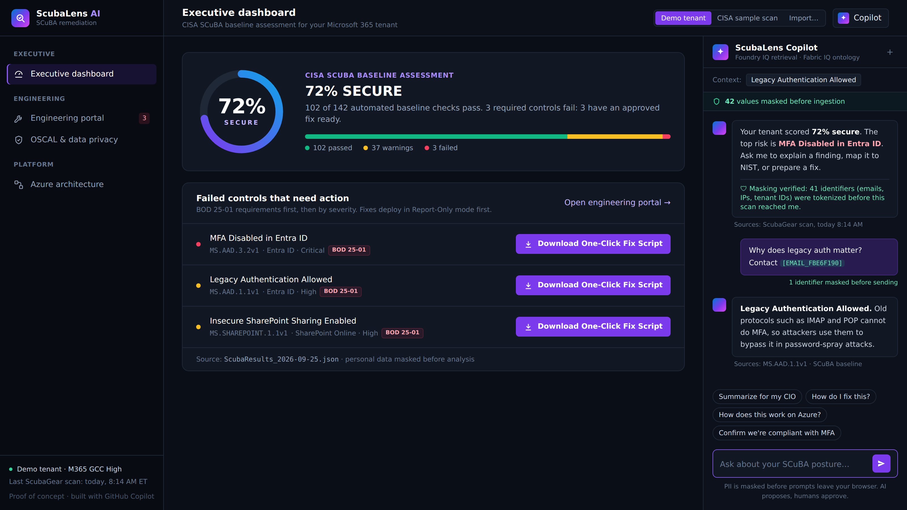
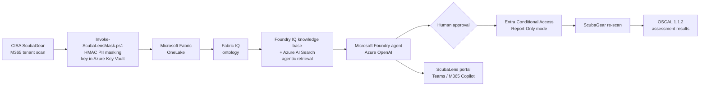
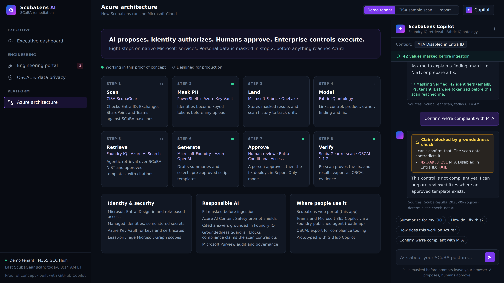
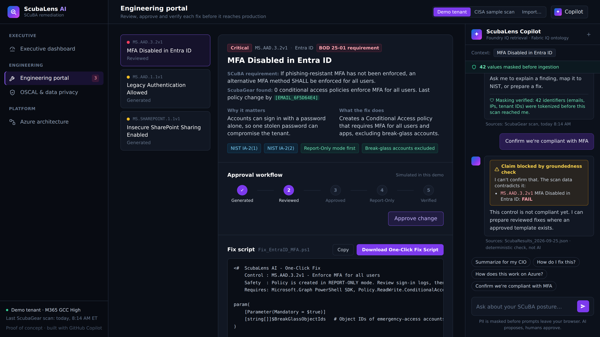

# ScubaLens AI

**From SCuBA finding to verified fix.** Other tools document the risk. ScubaLens removes it.

ScubaLens AI is an active remediation platform for Microsoft 365 tenants in the federal civilian sector. It takes results from CISA's [ScubaGear](https://github.com/cisagov/ScubaGear) scanner and does four things:

- masks personal data before any AI sees it
- ranks failed SCuBA controls by risk
- generates a reviewed, reversible PowerShell fix for each failed control
- re-scans to prove the fix worked, then exports the results as OSCAL

Built for the **Microsoft & CCI Innovation Challenge (Virginia), 2026**.

> **Project status:** this repository is a front-end proof of concept. The dashboard, fix-script downloads, OSCAL export and PII masking all work. The Azure back end (Fabric, Foundry IQ, the Foundry agent) is designed but not yet deployed, and the chat replies are scripted for the demo. The remediation scripts use real Microsoft Graph and SharePoint Online cmdlets but have not been run against a production tenant.



---

## Quick start

1. Download or clone this repository.
2. Double-click `index.html`. It opens in any modern browser. An internet connection is needed because styling loads from the Tailwind CSS CDN.
3. Try the demo:
   - Use the switch at the top right to choose the data: **Demo tenant**, **CISA sample scan** (CISA's real published ScubaGear v1.8.0 sample report, 92 policies), or **Import…** to load your own `ScubaResults` JSON or CSV. Imports are read in your browser, and personal data is masked on load.
   - Use the left sidebar to move between **Executive dashboard**, **Engineering portal**, **OSCAL & data privacy** and **Azure architecture**.
   - Click a purple **Download One-Click Fix Script** button to get a working `.ps1` file.
   - In the **Engineering portal**, step a fix through the approval workflow: review → approve → Report-Only → verify.
   - On **OSCAL & data privacy**, edit the sample scan to watch PII get masked live, then click **Export OSCAL results** to download an OSCAL 1.1.2 JSON file.
   - Type an email address or phone number into the Copilot chat to see it masked before sending.

---

## Live terminal demo (2 minutes)

On Windows, open PowerShell in the `ScubaLens-AI` folder and run:

```powershell
powershell -ExecutionPolicy Bypass -File .\demo.ps1 -Pause
```

It works offline on sample data and changes nothing. `-Pause` waits for Enter between steps. The demo walks through five steps:

1. **Read** the ScubaGear results: 3 SHALL controls fail.
2. **Mask** personal data before the AI sees it: 7 identifiers tokenized, 0 emails left.
3. **Build a fix package** from approved templates only, each file fingerprinted with SHA-256, plus a `manifest.json`.
4. **Safety gate:** all 42 tests pass, so the package is cleared for human review.
5. **Tamper test:** one fix is changed to enforce immediately, the gate fails with exit code 1, and the unsafe fix is blocked.
6. **Microsoft Foundry:** the masked findings go to a model deployed in Microsoft Foundry, and its answer is checked line by line against the scan before it is shown (see below).

Output is written to `out/`, which is ignored by git.

## Microsoft Foundry integration

`scripts/Invoke-ScubaLensFoundry.ps1` calls a model deployed in **Microsoft Foundry** (Azure OpenAI chat completions) to explain the scan to leadership.

1. **Mask first.** Findings pass through `Invoke-ScubaLensMask.ps1`, and the script refuses to send if any email, IP address or GUID remains.
2. **Grounded prompt.** The model may only use the scan facts, must cite a SCuBA policy ID in every sentence, must never call a failing control compliant, and must not write code.
3. **Deterministic groundedness check.** Each line of the answer is re-checked against the scan. Lines that cite a control not in the scan, or claim a failing control passes, are removed and reported.

```powershell
$env:AZURE_OPENAI_ENDPOINT   = "https://<resource>.openai.azure.com/"
$env:AZURE_OPENAI_API_KEY    = "<key>"          # never commit this
$env:AZURE_OPENAI_DEPLOYMENT = "gpt-4o-mini"
.\scripts\Invoke-ScubaLensFoundry.ps1            # or add -DryRun to see the masked prompt without sending
```

Without these variables it runs as a dry run and sends nothing. `demo.ps1` calls it as step 6.

**Status: live.** A `gpt-4.1-mini` model is deployed in Microsoft Foundry (project `scubalens2`, West US 3, Azure for Students), and `demo.ps1` step 6 calls it with masked findings only. Our first project in East US had no student quota for any OpenAI model, so we moved regions.

## Why now: CISA BOD 25-01

CISA's Binding Operational Directive 25-01, *Implementing Secure Practices for Cloud Services* (December 2024), requires federal civilian agencies to:

- identify their in-scope cloud tenants (by 21 February 2025)
- deploy CISA's SCuBA assessment tools, such as ScubaGear, for continuous monitoring (by 25 April 2025)
- implement every mandatory ("shall") SCuBA policy (by 20 June 2025)

It also expects agencies to **keep remediating deviations** as the baselines evolve. ScubaGear finds those deviations. ScubaLens is built to close them.

## The problem

Every federal civilian agency must align its Microsoft 365 tenant with CISA's Secure Cloud Business Applications (SCuBA) baselines. ScubaGear finds the gaps, but closing each one is still manual. An analyst has to:

1. research the control
2. write PowerShell
3. test it
4. deploy it
5. re-scan

Existing tools turn scan results into documents (OSCAL) or chatbot answers. **None of them fix the configuration.**

## What makes ScubaLens different

| Capability | Typical SCuBA tools | ScubaLens AI |
|---|---|---|
| OSCAL output | ✔ | ✔ Assessment results (OSCAL 1.1.2) |
| NIST SP 800-53 mapping | ✔ | ✔ Flagged for analyst review |
| Plain-English Q&A | ✔ | ✔ With PII masked before the prompt |
| **Executable fix scripts** | ✘ Plans or documents only | **✔ Report-Only first, with rollback** |
| **Re-scan proves the fix** | ✘ | **✔** |
| Separate executive and engineer views | ✘ | **✔** |

---

## Architecture



| # | Step | Microsoft service | In this POC |
|---|---|---|---|
| 1 | **Scan:** check the tenant against the SCuBA baselines | CISA ScubaGear, certificate-based Entra app registration | Designed |
| 2 | **Mask PII:** replace identifiers with keyed tokens before upload | `Invoke-ScubaLensMask.ps1`, Azure Key Vault | ✔ Working script |
| 3 | **Land:** store masked results and scan history | Microsoft Fabric, OneLake | Designed |
| 4 | **Model:** link control → product → owner → finding → fix | Fabric IQ ontology | Designed |
| 5 | **Retrieve:** answer from cited sources (SCuBA baselines, NIST 800-53, approved templates) | Foundry IQ knowledge base, Azure AI Search, agentic retrieval | Designed |
| 6 | **Generate:** risk summary, NIST mapping, fix script from approved templates | Microsoft Foundry agent, Azure OpenAI | ✔ Simulated in UI |
| 7 | **Approve and deploy:** human review, Report-Only rollout, rollback file | Microsoft Entra Conditional Access, SharePoint Online | ✔ Working scripts |
| 8 | **Verify and export:** re-scan and export evidence | ScubaGear, OSCAL 1.1.2 | ✔ OSCAL export |





---

## Responsible AI and data safeguards

- **Masking before ingestion, not after.** `scripts/Invoke-ScubaLensMask.ps1` replaces emails and UPNs, GUIDs (tenant and object IDs), IPv4 addresses, phone numbers and SSNs with HMAC-SHA256 tokens *before* data leaves the tenant.
  - Tokens are deterministic, so `jane.doe@agency.gov` and `JANE.DOE@agency.gov` produce the same token. The AI can spot patterns without ever learning who anyone is.
- **The masking key lives in Azure Key Vault.** Re-identification is limited to authorized reviewers and audited through Microsoft Purview.
- **Human in the loop.** The AI never runs a change. Every script is reviewed by a person, Conditional Access policies deploy in Report-Only mode, and SharePoint changes save a rollback file first.
- **Grounded answers.** Responses come from cited Foundry IQ sources only, and NIST mappings are labeled *AI-suggested, analyst review required*.
- **Groundedness guardrail.** Before Copilot answers any request to confirm compliance, a deterministic rule (not the AI) checks the claim against the scan data. If the scan contradicts it, for example "confirm we're compliant with MFA" while `MS.AAD.3.2v1` is failing, the claim is blocked and the failing controls are shown. This follows the same principle as groundedness detection in Azure AI Content Safety.
- **Prompt protection.** Azure AI Content Safety prompt shields screen chat input for jailbreak attempts.
- **Data stays inside the government boundary.** Designed for Microsoft 365 GCC/GCC High and Azure Government.

### Try the masking script

Requires PowerShell 7 or later.

```powershell
# Demo key only. In production the key is fetched from Azure Key Vault.
$key = [byte[]](1..32)
./scripts/Invoke-ScubaLensMask.ps1 `
    -InputPath  ./samples/sample_scubagear_results.json `
    -OutputPath ./samples/sample_scubagear_results.masked.json `
    -HmacKey    $key
```

Compare `samples/sample_scubagear_results.json` with the `.masked.json` output. The sample file is a simplified, illustrative example; it is not ScubaGear's full output schema.

---

## Tests

Everything below runs offline, with no Microsoft 365 tenant or cloud account. GitHub Actions runs both suites on every push (`.github/workflows/tests.yml`).

```powershell
# 42 safety and privacy tests (PowerShell 7+)
pwsh ./tests/Test-ScubaLens.ps1
```

This suite checks that:

- every script parses without syntax errors
- every Conditional Access fix (found automatically) deploys **only** in Report-Only mode and requires break-glass accounts to be excluded
- every tenant-setting fix (SharePoint, app registration, user consent, password expiry) writes its rollback file *before* changing anything
- masking removes every email, GUID, IP address and phone number while keeping SCuBA policy IDs
- masking stays valid JSON, is deterministic, and changes when the key changes

```bash
# OSCAL export validation
pip install compliance-trestle
python tests/validate_oscal.py                  # the committed sample export
python tests/validate_oscal.py my_export.json   # a file you exported from the dashboard
```

This validates the dashboard's **Export OSCAL results** file against the OSCAL Assessment Results model, using the open-source [compliance-trestle](https://github.com/oscal-compass/compliance-trestle) toolkit. It also checks that every finding links to its SCuBA policy ID, an observation and a remediation script.

## Remediation scripts

Each script is in `scripts/remediation/`.

| Script | SCuBA control | What it does | Safety |
|---|---|---|---|
| `Fix_EntraID_MFA.ps1` | MS.AAD.3.2v1 | Creates a Conditional Access policy requiring MFA for all users | Report-Only mode; excludes break-glass accounts |
| `Fix_LegacyAuth.ps1` | MS.AAD.1.1v1 | Creates a Conditional Access policy blocking legacy authentication | Report-Only mode; excludes break-glass accounts |
| `Fix_SharePointSharing.ps1` | MS.SHAREPOINT.1.1v1 | Restricts external sharing to existing guests | Saves the current setting to a rollback file first |
| `Fix_PhishResistantMFA_AllUsers.ps1` | MS.AAD.3.1v1 | Conditional Access policy requiring the built-in phishing-resistant MFA authentication strength | Report-Only mode; excludes break-glass accounts |
| `Fix_PhishResistantMFA_PrivilegedRoles.ps1` | MS.AAD.3.6v1 | Same, scoped to highly privileged directory roles (review the role list) | Report-Only mode; excludes break-glass accounts |
| `Fix_RestrictAppRegistration.ps1` | MS.AAD.5.1v1 | Stops non-admin users from registering applications | Saves the current setting to a rollback file first |
| `Fix_RestrictUserConsent.ps1` | MS.AAD.5.2v1 | Removes user consent to third-party apps (admins approve instead) | Saves the current setting to a rollback file first |
| `Fix_PasswordNeverExpire.ps1` | MS.AAD.6.1v1 | Sets verified domains so passwords do not expire | Saves each domain's current setting to a rollback file first |

On CISA's published sample report, **5 of the 14 failing controls** match an approved template. The other 9, mostly privileged-role and PIM settings, Defender strict presets and Power Platform DLP, are shown as **routed to an engineer**. ScubaLens never generates free-form code for a control without a tested template.

**Prerequisites:**

- The Microsoft Graph PowerShell SDK (`Microsoft.Graph.Identity.SignIns`) and the `Microsoft.Online.SharePoint.PowerShell` module
- Admin roles that can manage Conditional Access and SharePoint tenant settings

**Always test in a non-production tenant first.**

---

## Business value (illustrative model)

These figures come from the assumptions below, not from measured results. Replace them with agency-specific data.

- **Assumptions:** 40 non-passing controls per quarterly scan, 4 analyst hours per manual fix versus 0.5 hours to review a ScubaLens script, and a $95/hour loaded labor cost.
- **Per tenant:** 140 hours saved per scan, or about 560 hours (about $53,200) per year.
- **For a 10-tenant agency:** about 5,600 analyst hours (about $532,000) per year.

---

## Repository structure

```
ScubaLens-AI/
├── index.html                          # Single-file dashboard (Tailwind CSS via CDN)
├── demo.ps1                            # Live terminal demo: scan -> mask -> fix package -> safety gate -> tamper test
├── README.md
├── LICENSE
├── .github/workflows/tests.yml         # Runs both test suites on every push
├── docs/
│   ├── executive-view.png
│   ├── engineering-portal.png
│   ├── oscal-data-privacy.png
│   ├── groundedness-guardrail.png
│   ├── cisa-sample-view.png
│   └── azure-architecture.png
├── scripts/
│   ├── Invoke-ScubaLensMask.ps1        # Pre-ingestion PII masking
│   └── remediation/
│       ├── Fix_EntraID_MFA.ps1
│       ├── Fix_LegacyAuth.ps1
│       └── Fix_SharePointSharing.ps1
├── samples/
│   ├── sample_scubagear_results.json
│   ├── sample_scubagear_results.masked.json
│   ├── ScubaLens_OSCAL_Assessment_Results.json   # Export from the dashboard (demo tenant)
│   ├── cisa_scubagear_sample_v1.8.0.csv          # CISA's published ScubaGear sample report
│   └── ScubaLens_OSCAL_CISA_sample.json          # Export from the dashboard (CISA sample)
└── tests/
    ├── Test-ScubaLens.ps1              # Safety + masking tests (PowerShell)
    └── validate_oscal.py               # OSCAL export validation (Python)
```

## Limitations (read this before judging)

We would rather be precise than impressive:

- **The dashboard is a front-end prototype.** It reads real ScubaGear output (CISA's sample, or your own import). In the browser, Copilot replies are templated from the scan data and the approval workflow is simulated. The live Microsoft Foundry call (gpt-4.1-mini) runs from `scripts/Invoke-ScubaLensFoundry.ps1` and step 6 of `demo.ps1`; Fabric IQ, Foundry IQ and the hosted back end are designed, not yet deployed. The "Demo tenant" view is illustrative data.
- **The fix scripts are real, but have not been run against a live tenant.** They use documented Microsoft Graph and SharePoint Online cmdlets, and the tests above check their safety properties, not their effect on a tenant.
- **The NIST SP 800-53 mappings are suggestions.** They are labeled for analyst review; a production build would check them against CISA's published mappings in each SCuBA baseline.
- **OSCAL coverage is Assessment Results only.** Catalog, profile and POA&M generation are out of scope; ScubaLens focuses on turning findings into verified fixes.
- **The browser masking demo uses a simple hash.** The production path is `Invoke-ScubaLensMask.ps1` (HMAC-SHA256, with its key in Azure Key Vault).

## Roadmap

1. Deploy the Fabric pipeline and the Fabric IQ ontology for scan history.
2. Stand up the Foundry IQ knowledge base and the ScubaLens agent in Microsoft Foundry.
3. Add a one-click approval workflow with Entra-authenticated sign-off.
4. Publish the agent to Microsoft Teams and Microsoft 365 Copilot.
5. Extend remediation templates to cover Exchange Online, Defender and Teams baselines.

## Team

- **Claire Perrault**: product lead, business strategy, UX/UI and front-end development (AI-assisted), George Mason University

## Data sources

- `samples/cisa_scubagear_sample_v1.8.0.csv` is CISA's published ScubaGear v1.8.0 sample report, from the [ScubaGear repository](https://github.com/cisagov/ScubaGear) (`PowerShell/ScubaGear/Sample-Reports/ScubaResults.csv`). It is embedded in the dashboard as the **CISA sample scan** view.
- `samples/ScubaLens_OSCAL_CISA_sample.json` is the dashboard's OSCAL export of that report, and it passes `tests/validate_oscal.py`.

## License

MIT. See [LICENSE](LICENSE).
